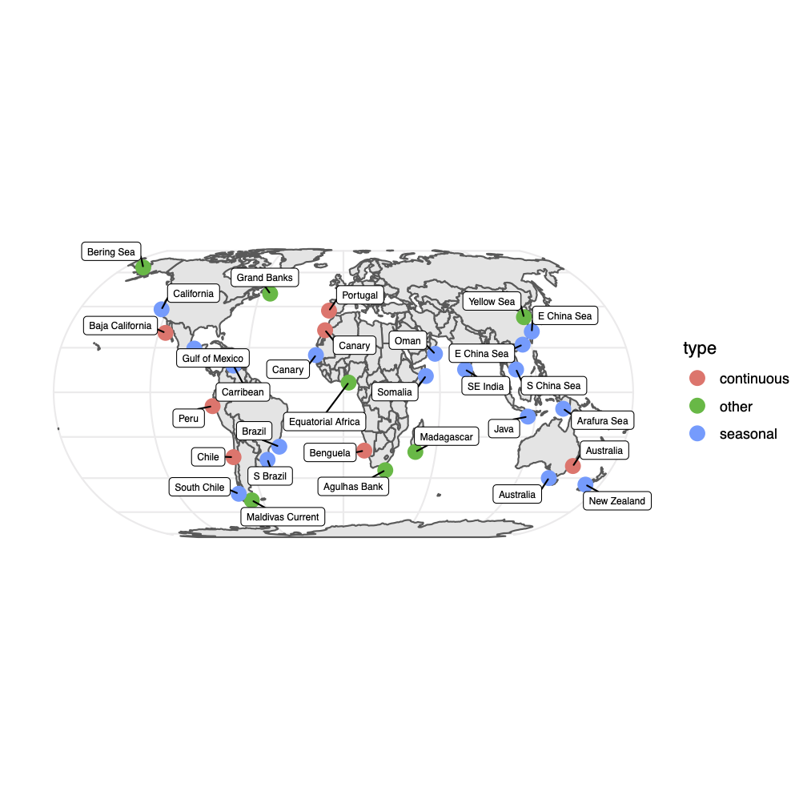

# NASA Hackweek 2021 - Upwelling

## Spatio-temporal changes in global upwelling patterns

### Project Summary

Brief title describing the proposed work.

### Collaborators on this project

Project lead: Eli Holmes, NOAA

### The problem

What problem are you going to explore? Provide a few sentences. If this is a technical exploration of software or data science methods, explain why this work is important in a broader context.

### Application Example

List one specific application of this work.

### Sample data

If you already have some data to explore, briefly describe it here (size, format, how to access).

### Specific Questions

List the specific tasks you want to accomplish or research questions you want to answer.

### Existing methods

How would you or others traditionally try to address this problem?

### Proposed methods/tools

Building from what you learn at this hackweek, what new approaches would you like to try to implement?

### Background reading

### Notes

